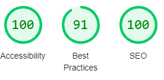

# Alexander Hamilton

'Alexander Hamilton' is a history site, aimed at portraying how he went from being an orphan in the Caribbean to one of the most important people in American history.

Users of this website will be able to read about his life, career and his legacy that still lives on to this day, in addition to entering a competition to win a free trip to Washington DC.

## Features

### Navigation

    *   At the top of the page, there is the name of the site as a logo, clicking this will navigate the user back to the page about his life and career.
    *   Other navigation links can be found to the right of the h1 logo within a dropdown toggle, these include the pages about his legacy and the competition page.
    *   The layout of the navigation is fairly simple and should be easy for users to use
    *   The font contrasts the background colour so is easy to read
    *   Each image has an alt text value in case they don't load in a browser and to make them more accessible to visually impaired users

### The Header

    *   The header encapsulates the nav element to make the dropdown menu responsive
    *   The header also links each dropdown option to its own html page.

### The 'His Life' section

   *   This section adds images to give some insight into his life, this is then followed by the career section, which provides context and gives information about how he became such an important figure in American politics.

### The timeline

    *   This section adds insight to important events in Hamilton's life
    *   This is then followed by more images at the bottom of the page, also with alt attributes for visually impaired users.

### The Legacy Page

    *   This page adds insight into how his legacy is still celebtated to this day, including some references to  a biography that was written by a historian and the world-renowned musical 'Hamilton'
    *   This page also has images along the bottom of the page to illustrate how he is still celebrated

### The Competition Page

    *   This page includes a form where users can enter a competition to win a trip to Washington DC
    *   This requires users to input their full name and email address in order to enter, followed by selecting an option from multiple choice radio buttons
    *   Each field must be filled in, iuncluding with a valid email address, in order for the user to submit their entry

### The Footer section

    *   The footer contains links to popular social media sites, which would allow other sites and pages to be linked to the page to add further information
    *   Each icon is clickable and they are spaced evenly across the footer, and are a colour which follows the colour scheme of the site and is easy to see against the background.

## Testing

*   I confirmed that the site works within the IDE and when deployed onto the browser

*   I confirmed that the page is repsonsive and functions on different screen nsizes using DevTools device bar

*   I checked that the text is readable across all pages, and that is would be easy for users to understand

*   I have confirmed that the form on the competition page works, by inputting data into each field, the email address field will only acceot a valid email address and you can't submit without filling in all the fields.

## Bugs

*   When I deployed my project to GitHub I noticed that there were some issues with the spacing, I amended this by adding the br element between each section
*   I also noticed that the submit button was missing from the form, so I amended my code to ensure it could be seen on GitHub

## Validator Testing

*   HTML
    *   No errors were found in my html code after passing it through the W3C validator

*   CSS
    *   No errors were found in passing my css code after passing it through the W3C validator

*   Accessibility
    *   I confirmed that there was sufficient contrast between the background colour and font colour to make it easy to read
    *   I ran the code through lighthouse in devtools
  

### Unfixed bugs

No unfixed bugs found

## Deployment

*   The site was deployed to GitHub pages by:
  
    *   Going to the GitHub repository and accessing 'Settings'
    *   Selecting the 'Master Branch' in the source section dropdown

## Credits

### Content

*   The code to make the social media links was taken from the CI Love Running Project - https://github.com/Code-Institute-Solutions/love-running-v3/tree/main/3.1-setting-up-the-basic-html-structure

*   The information from the pages came from the biography 'Alexander Hamilton' by Ron Chernow

*   Information on how to build the timeline came from <https://www.w3schools.com/howto/howto_css_timeline.asp>

### Media

*   All images were taken from Pexels - https://www.pexels.com/
